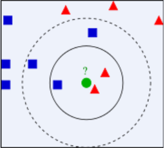
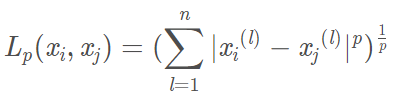

# KNN 算法

### 1. 算法简介

k-近邻（k-Nearest Neighbor，kNN）算法是一种基本的分类与回归算法，其思想可概括为“近朱者赤 近墨者黑”、“物以类聚 人以群分”，我们想要判断一个人的品行如何，只需要观察和他关系最密切的几个人品行好坏。

kNN用作分类预测时，一般采用**多数表决法**，即如果一个样本在特征空间中的k个最邻近的样本中的大多数属于某一个类别，则该样本也划分为这个类别；

kNN用作回归分析时，一般采用**平均法**，即最近的K个样本的样本输出的平均值作为回归预测值。

本文学习 kNN 用作分类算法的情况。

---

### 2. 算法原理

**算法思路**：为判断某未知样本的类别，以所有已知类别的样本作为参照，计算未知样本与所有已知样本的**距离**，从中选取与未知样本**距离最近的 k 个**已知样本，根据少数服从多数的原则，将未知样本与 k  个最邻近样本中所属类别占比较多的归为一类。

**算法步骤**：

对于类别未知的测试数据点，依次执行以下操作：

​	1）计算测试数据点与所有类别已知的训练数据点之间的**距离**；

​	2）按照距离递增顺序进行排序；

​	3）选取距离最小的 **k** 个点；

​	4）确定这 k 个点所属的类别，统计类别出现的频率；

​	5）返回这 k 个点中出现**频率最高**的类别作为该测试数据点的预测分类。



上图中，绿色圆圈是待分类的测试数据，如果 k=3 此时选取距离最近的3个样本，发现其中2个属于红色三角形类占比2/3，1个属于蓝色正方形类占比1/3，于是将绿色圆圈归为红色三角形类；如果 k=5 此时选取距离最近的5个样本，发现其中3个属于蓝色正方形类占比3/5，2个属于红色三角形类占比2/5，于是将其归为蓝色正方形类。

**基本要素**：从上面的算法原理和实例中可以发现 kNN 算法并不复杂，但是其中涉及到了比较重要的三个基本要素：距离的度量、k值的选择 和 分类决策规则。接下来介绍这三个要素：

**i.** 距离的度量

距离度量是描述特征空间中两个实例的距离，也就是这两个实例的相似程度。kNN 算法的特征空间一般是n维实数向量空间 R^n^。一般使用的欧氏距离，当然也可以使用其他距离度量方式。

设特征空间 X 是 n 维实数向量空间 R^n^，x~i~, x~j~ ∈ X， x~i~，x~j~ 的距离 L~p~ 定义为：



① 欧氏距离（Euclidean distance）


② 曼哈顿距离（Manhattan distance）


③ 闵可夫斯基距离（Minkowski distance）


**ii.** k 值的选择

k 指**近邻样本数**，从上面提到的例子中可以看到 k=3 与 k=5 时，得到的预测分类是不同的，所以说 k 值的选取策略十分重要。

- 选择较小的 k 值，就相当于用较小的邻域中的训练实例进行预测，“学习”的近似误差（approximation error）会减小，只有与输入实例较近的（相似的）训练实例才会对预测结果起作用。但缺点是“学习”的估计误差（estimation error）会增大，预测结果会对近邻的实例点非常敏感。如果邻近的实例点恰巧是噪声，预测就会出错。换句话说，**k值的减小就意味着整体模型变得复杂，容易发生过拟合**；
- 选择较大的 k 值，就相当于用较大的邻域中的训练实例进行预测。其优点是可以减少“学习“的估计误差。但缺点是”学习“的近似误差会增大。这时与输入实例较远的（不相似的）训练实例也会对预测起作用，使预测发生错误。换句话说，**k值的增大就意味着整体的模型变得简单，容易发生欠拟合。**

然鹅对于 k 值的选择，并没有一个固定的经验，一般根据样本的分布选择一个较小的值，然后通过**交叉验证**选择一个合适的k值。

常用的方法是从k=1开始，使用检验集估计分类器的误差率。重复该过程，每次K增值1，允许增加一个近邻，选取产生最小误差率的K。一般k的取值不超过20，上限是n的开方，随着数据集的增大，K的值也要增大。


**iii.** 分类决策规则

分类决策，在分类问题中通常为通过少数服从多数（**多数表决**）来选取票数最多的标签；在回归问题中通常为 K个最邻点的标签的平均值（平均法）。

---

### 3. 算法优缺点

**优点**：

①简单，易于理解，易于实现，无需参数估计，无需训练；

②精度高，对异常值不敏感（个别噪音数据对结果的影响不是很大）;

③适合对稀有事件进行分类；

④特别适合于多分类问题(multi-modal,对象具有多个类别标签)，KNN要比SVM表现要好。

**缺点**：

①对测试样本分类时的计算量大，空间开销大，因为对每一个待分类的文本都要计算它到全体已知样本的距离，才能求得它的K个最近邻点。目前常用的解决方法是事先对已知样本点进行剪辑，事先去除对分类作用不大的样本；

②可解释性差，无法给出决策树那样的规则；

③最大的缺点是当样本不平衡时，如一个类的样本容量很大，而其他类样本容量很小时，有可能导致当输入一个新样本时，该样本的K个邻居中大容量类的样本占多数。该算法只计算“最近的”邻居样本，某一类的样本数量很大，那么或者这类样本并不接近目标样本，或者这类样本很靠近目标样本。无论怎样，数量并不能影响运行结果。可以采用权值的方法（和该样本距离小的邻居权值大）来改进；

④消极学习方法。

---

### 4. 算法实现

- 代码实现（Algorithm）

```python
import operator
from numpy import *

def loadDataSet():
    # 创建数据集
    data = array([1,1], [-1,1], [-1,-1], [1,-1])
    # 打标签
    labels = ['A', 'A', 'B', 'B']
    return data, labels

def classify_(inX, dataSet, labels, k):
    """
    inX:待分类的样本点，在这里就是一个坐标
    dataSet:样本训练集
    labels:样本的标签列表
    k:近邻样本数
    """
    # shape方法作用是得到列表各维的长度，如shape[0]返回的是列表第一维长度
    dataSetSize = dataSet.shape[0]
    # 计算测试样本到每个训练集中每个样本点的欧氏距离
    """
    tile(A,reps)
    A:输入的array
    reps:A沿各个维度重复的次数
    eg.A=[1,2]
    tile(A,2) = array([1, 2, 1, 2])
    tile(A,(2,2)) = array([[1, 2, 1, 2],
       					[1, 2, 1, 2]])
    所以这个tile的作用就是复制出n个inX，n是dataSet第一维的长度，由于dataSet是一维列表，因此这里n	  就是dataSet中元素的个数
    """
    diffMat = tile(inX, (dataSetSize,1)) - dataSet
    sqDiffMat = diffMat**2
    sqDistances = sqDiffMat.sum(axis=1)
    distances = sqDistances**0.5
    # 计算完所有点的距离后，对数据按照从小到大的次序排序
    sortedDistIndicies = distances.argsort()
    # 创建一个用于统计分类的字典
    classCount={}
    # 统计距离最近的 k 个样本点的类别
    for i in range(k):
        # “投票”
        voteIlabel = labels[sortedDistIndicies[i]]
        # “计票”，需解释这里字典的get方法:
        # dic.get(key,default=None)
        # key:要在字典中查找的键
        # default:如果指定键的值不存在，则返回该默认值(默认为None)
        classCount[voteIlabel] = classCount.get(voteIlabel,-1) + 1
    sortedClassCount = sorted(classCount.items(), key=operator.itemgetter(1), reverse=True)
    return sortedClassCount[0][0]

group, labels = createDataSet()
classify_([0,-0.5],group,labels,3)
```


- 调包侠来辣（sklearn）

```python
import numpy as np
import matplotlib.pyplot as plt
from sklearn.datasets import make_blobs
from sklearn.neighbors import KNeighborsClassifier
from sklearn.model_selection import train_test_split

# 生成数据
X,y = make_blobs(n_samples=500, n_features=2, centers=[[-12,-12],[-14,15],[2,4],[15,15]], cluster_std=4, random_state=9)

clf = KNeighborsClassifier()
clf.fit(X,y)

x_min, x_max = X[:,0].min()-1, X[:,0].max()+1
y_min, y_max = X[:,1].min()-1, X[:,1].max()+1
xx, yy = np.meshgrid(np.arange(x_min,x_max,.02), np.arange(y_min,y_max,.02))
z = clf.predict(np.c_[xx.ravel(),yy.ravel()])

z = z.reshape(xx.shape)
plt.pcolormesh(xx,yy,z,cmap=plt.cm.Pastel1)
plt.scatter(X[:,0], X[:,1],s=10, c=y)
plt.xlim(xx.min(),xx.max())
plt.ylim(yy.min(),yy.max())
plt.title("Classifier:KNN")
 
# 把待分类的数据点用五星表示出来
plt.scatter(12,12,marker='*',c='red',s=200)
 
# 对待分类的数据点的分类进行判断
res = clf.predict([[12,12]])
plt.text(12,12,'Classification flag: '+str(res))
 
plt.show()
```


---

 

[1]: https://github.com/apachecn/AiLearning	"AiLearning-k近邻算法"
[2]: https://blog.csdn.net/pengjunlee/article/details/82713047	"机器学习之KNN最邻近分类算法"
[3]: https://www.cnblogs.com/huangyc/p/9716079.html	"K近邻算法（KNN）"
[4]: 《机器学习实战》

